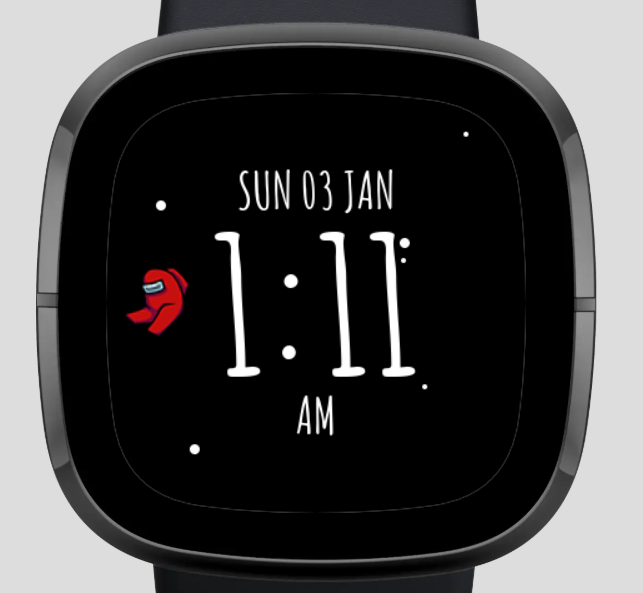

Among Us Watch Face/Faces
==========
The current project setup is copied off my other program (That I didn't finish). Just need to swap it over.

This is just a quick project to test out watch faces and ideas.

## Current Screenshots
Just mostly testing embedding images in github but also just to make a quick preview (ill try to keep it up to date)

## Plans
I am looking to make this into a fully functioning app with the basic Pomodoro features.
Possibly some more Fitbit apps down the road :D

# Some general Fitbit app development info/links
I thought this section would be helpful for links as well as for personal notes for me.

## Making a New Project
This took me a bit longer than it should have to find. Take a look at https://dev.fitbit.com/build/guides/command-line-interface/#creating-a-new-project

### To connect the debugger
run `npm debug` then `connect phone` and `connect device` (though make sure they are not connected to any other processes e.g. Fitbit studio)

To install the project then run `build` then `install` or use `bi` to do both in one command.

You can also look at https://dev.fitbit.com/build/guides/command-line-interface/ for more info

## References & Guides
### [Guides](https://dev.fitbit.com/build/guides/)
* [App Architecture](https://dev.fitbit.com/build/guides/application/)
* [Clock Faces](https://dev.fitbit.com/build/guides/clockfaces/)
* [Command Line Interface](https://dev.fitbit.com/build/guides/command-line-interface/)
* [Communications](https://dev.fitbit.com/build/guides/communications/)
* [Companion](https://dev.fitbit.com/build/guides/companion/)
* [Design Guidelines](https://dev.fitbit.com/build/guides/design-guidelines/)
* [File System](https://dev.fitbit.com/build/guides/file-system/)
* [Geolocation](https://dev.fitbit.com/build/guides/geolocation/)
* [Glossary](https://dev.fitbit.com/build/guides/glossary/)
* [Localization](https://dev.fitbit.com/build/guides/localization/)
* [Migration](https://dev.fitbit.com/build/guides/multiple-devices/)
* [Multiple Devices](https://dev.fitbit.com/build/guides/multiple-devices/)
* [Permissions](https://dev.fitbit.com/build/guides/permissions/)
* [Publishing](https://dev.fitbit.com/build/guides/publishing/)
* [Sensors](https://dev.fitbit.com/build/guides/sensors/)
* [Settings](https://dev.fitbit.com/build/guides/settings/)
* [User Interface](https://dev.fitbit.com/build/guides/user-interface/)

### [References](https://dev.fitbit.com/build/reference/)
* [Device API](https://dev.fitbit.com/build/reference/device-api/)
* [Companion API](https://dev.fitbit.com/build/reference/companion-api/)
* [Settings API](https://dev.fitbit.com/build/reference/settings-api/)
* [Web API](https://dev.fitbit.com/build/reference/web-api/)
